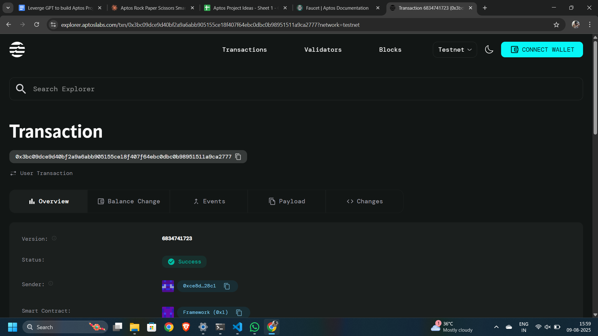

# Rock Paper Scissors

## Project Description

A decentralized multiplayer Rock Paper Scissors game built on the Aptos blockchain using Move smart contracts. This implementation features a commit-reveal scheme to ensure fair gameplay by preventing players from seeing their opponent's move before making their own decision. The smart contract manages game state, validates moves, and automatically determines winners without requiring a trusted third party.

## Project Vision

Our vision is to create a transparent, trustless, and engaging gaming experience on the blockchain where players can enjoy classic games with guaranteed fairness. By leveraging blockchain technology and cryptographic commit-reveal schemes, we eliminate the possibility of cheating while maintaining the fun and competitive spirit of traditional Rock Paper Scissors.

The project aims to demonstrate how simple games can be enhanced through blockchain technology, providing a foundation for more complex decentralized gaming applications and fostering adoption of Web3 gaming experiences.

## Key Features

### 🎮 **Fair Gameplay**
- Commit-reveal scheme prevents move prediction and cheating
- Cryptographically secure move commitment using hash functions
- Automated winner determination through smart contract logic

### 🔒 **Trustless Environment**
- No central authority or game server required
- All game logic executed on-chain with transparent rules
- Immutable game history stored on the blockchain

### ⚡ **Simple Integration**
- Lightweight smart contract with minimal gas costs
- Clean and intuitive function interface
- Easy to integrate with frontend applications

### 🌐 **Multiplayer Support**
- Direct player-to-player games
- Address-based player identification
- Real-time game state tracking

### 📊 **Game Analytics**
- Timestamp tracking for game creation
- Complete move history preservation
- Winner statistics and game outcomes

## Future Scope

### 🚀 **Enhanced Gaming Features**
- **Tournament System**: Implement bracket-style tournaments with multiple players
- **Betting Mechanism**: Add token staking and reward distribution for winners
- **Extended Game Modes**: Support for best-of-3, best-of-5, and custom game formats
- **Time Limits**: Add automatic forfeit mechanisms for inactive players

### 🏆 **Competitive Elements**
- **Player Rankings**: Global leaderboard and ELO rating system
- **Achievement System**: Unlock badges and rewards for milestones
- **Seasonal Competitions**: Regular tournaments with special prizes
- **Team Play**: Multi-player team-based Rock Paper Scissors variants

### 🔧 **Technical Improvements**
- **Gas Optimization**: Reduce transaction costs through code optimization
- **Cross-chain Support**: Enable gameplay across different blockchain networks
- **Mobile Integration**: Native mobile app with seamless wallet connection
- **Advanced Cryptography**: Enhanced privacy features and zero-knowledge proofs

### 🌍 **Community Features**
- **Social Integration**: Friend systems and private game rooms
- **Spectator Mode**: Live viewing of ongoing games
- **Game Replays**: Historical game analysis and sharing
- **Community Governance**: Player-driven rule changes and updates

### 📈 **Monetization & Economy**
- **NFT Integration**: Collectible game pieces and cosmetic items
- **Play-to-Earn**: Token rewards for active players
- **Marketplace**: Trading platform for in-game assets
- **Sponsorship System**: Brand partnerships and advertising opportunities

## Contract Details
0x3bc09dce9d40bf2a9a6abb905155ce18f407f64ebc0dbc0b98951511a9ca2777
